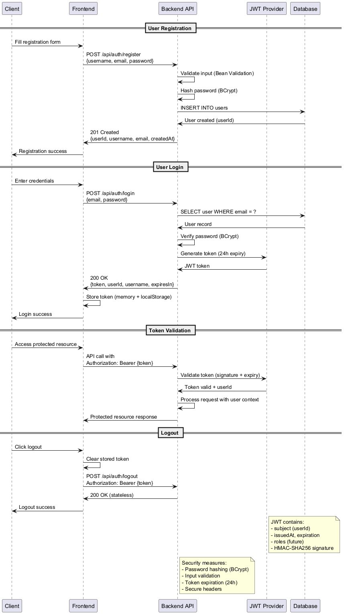
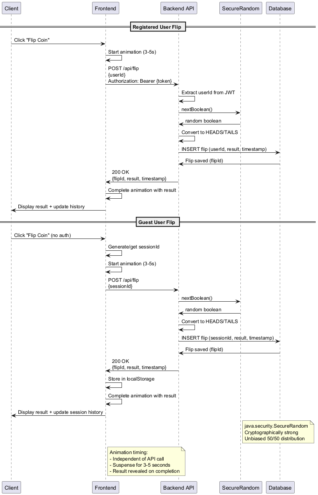
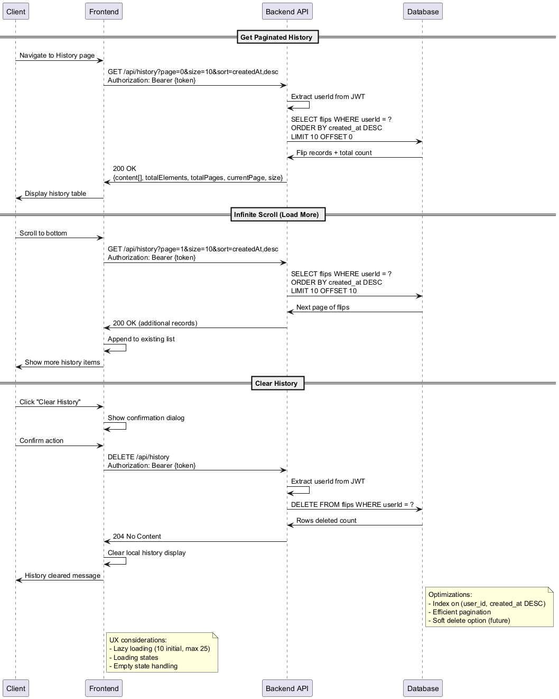
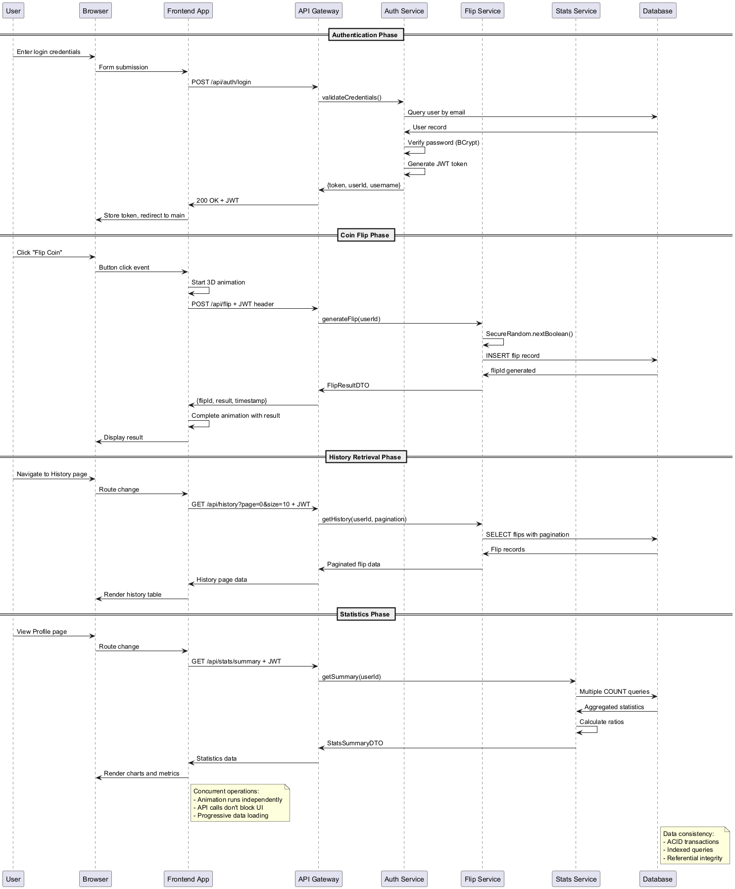

# Coin Flip Application API Reference

Version: v0 (MVP)
Base URL (Dev): `http://localhost:8080/api`
Auth: JWT (Bearer token) for protected endpoints. Guests may access limited endpoints without a token.
Format: JSON request/response, UTF-8 encoding.

### Related Documents
- **Architecture**: `ARCHITECTURE.md` (sequence & data flow context for endpoints).
- **Security**: `SECURITY.md` (JWT lifecycle, password policy, threat mitigations).
- **Testing**: `TESTING.md` (API contract, integration & E2E validation coverage).
- **Requirements**: `PRD.md` (source of truth for endpoint necessity & rationale).
- **Roadmap**: `ROADMAP.md` (future versioning, admin & real-time enhancements).

The API surface here represents the MVP (v0). Future breaking changes will introduce `/api/v1/` namespacing; see Versioning Strategy section and `ROADMAP.md`.

## 1. Conventions
| Aspect | Convention |
|--------|------------|
| Pagination | `page` (0-based), `size` (default 10, max 25) |
| Sorting | `sort=field,(asc|desc)` (default: `createdAt,desc`) |
| Dates | ISO-8601 UTC timestamps (e.g., `2025-11-04T10:30:00Z`) |
| Errors | Standard JSON error envelope (see below) |
| Auth | `Authorization: Bearer <jwt>` header |
| Content Type | `Content-Type: application/json` |

## 2. Standard Error Format
```
{
  "timestamp": "2025-11-04T10:30:00Z",
  "status": 400,
  "error": "Bad Request",
  "code": "VALIDATION_ERROR",
  "message": "Email is invalid",
  "path": "/api/auth/register"
}
```
Possible `code` values: `VALIDATION_ERROR`, `AUTH_FAILED`, `RESOURCE_NOT_FOUND`, `ACCESS_DENIED`, `INTERNAL_ERROR`.

## 3. Authentication

### 3.1 Authentication Flow Diagram


### Register
```
POST /api/auth/register
```
Request:
```json
{
  "username": "string (3-50 chars, required)",
  "email": "string (valid email, max 100 chars, required)",
  "password": "string (min 8 chars, required)"
}
```
Responses:
- **201 Created:**
```json
{
  "token": "jwt-string",
  "tokenType": "Bearer",
  "expiresIn": 86400,
  "user": {
    "userId": "uuid",
    "username": "string",
    "email": "string",
    "isAdmin": false,
    "createdAt": "2025-11-04T10:30:00Z"
  }
}
```
- **400 Validation Error:** Invalid input fields
- **409 Conflict:** Username or email already exists

### Login
```
POST /api/auth/login
```
Request:
```json
{
  "usernameOrEmail": "string (username or email, required)",
  "password": "string (required)"
}
```
Success **200 OK:**
```json
{
  "token": "jwt-string",
  "tokenType": "Bearer", 
  "expiresIn": 86400,
  "user": {
    "userId": "uuid",
    "username": "string",
    "email": "string",
    "isAdmin": false,
    "createdAt": "2025-11-04T10:30:00Z"
  }
}
```
Errors: **401 Unauthorized** - Invalid credentials

### Logout
```
POST /api/auth/logout
```
**Headers:** No authentication required (client-side operation)

Success **200 OK:**
```json
{
  "message": "Logout successful"
}
```
*Note: With JWT, logout is primarily client-side token removal. Server-side blacklisting planned for future with Redis.*

### Validate Token
```
GET /api/auth/validate
Authorization: Bearer {token}
```
Success **200 OK:**
```json
{
  "userId": "uuid",
  "username": "string", 
  "email": "string",
  "isAdmin": false,
  "createdAt": "2025-11-04T10:30:00Z"
}
```
Errors: **401 Unauthorized** - Invalid or expired token

## 4. Coin Flip

### 4.1 Coin Flip Flow Diagram


### Perform Flip
```
POST /api/flip
```
**Auth:** Optional (supports both authenticated users and guests)

**Request (Authenticated User):**
```json
{
  "userId": "uuid (optional, extracted from JWT if not provided)"
}
```
**Headers:** `Authorization: Bearer {token}`

**Request (Guest User):**
```json
{
  "sessionId": "string (required for guests, auto-generated if null)"
}
```

**Response 200 OK:**
```json
{
  "flipId": "uuid",
  "result": "HEADS" | "TAILS", 
  "timestamp": "2025-11-04T10:30:00Z",
  "ownerType": "user" | "guest"
}
```

**Implementation Notes:**
- Uses `java.security.SecureRandom` for cryptographically strong randomness
- Supports dual-mode operation: JWT authentication OR session-based guests
- Auto-generates session ID if not provided for guest requests
- Falls back to guest mode if JWT validation fails
- Stores flip with appropriate user ID or session ID for history tracking

**Errors:**
- **400 Bad Request:** Missing required userId for authenticated request
- **401 Unauthorized:** Invalid JWT token (falls back to guest if sessionId provided)

## 5. History

### 5.1 History Management Flow


### Get History
```
GET /api/history?page=0&size=10&sort=createdAt,desc&sessionId={sessionId}
```
**Auth:** Optional (supports both authenticated users and guests)

**Query Parameters:**
- `page`: Page number (0-indexed, default: 0)
- `size`: Page size (1-25, default: 10, capped at 25)
- `sort`: Sort field and direction (default: `createdAt,desc`)
- `sessionId`: Required for guest history (ignored if authenticated)

**Headers (Authenticated):** `Authorization: Bearer {token}`

**Response 200 OK:**
```json
{
  "content": [
    {
      "flipId": "uuid",
      "result": "HEADS" | "TAILS",
      "createdAt": "2025-11-04T10:30:00Z"
    }
  ],
  "totalElements": 42,
  "totalPages": 5,
  "currentPage": 0,
  "pageSize": 10,
  "first": true,
  "last": false
}
```

**Implementation Notes:**
- Automatically detects user vs guest based on JWT presence
- For authenticated users: fetches from user's flip history
- For guests: requires `sessionId` parameter
- Page size automatically capped at 25 for performance
- Returns empty page if no authentication and no sessionId provided

**Errors:**
- **400 Bad Request:** Invalid page/size parameters or missing sessionId for guest
- **401 Unauthorized:** Invalid JWT (falls back to guest mode if sessionId provided)

### Clear History
```
DELETE /api/history?sessionId={sessionId}
```
**Auth:** Optional (supports both authenticated users and guests)

**Query Parameters:**
- `sessionId`: Required for guest history deletion (ignored if authenticated)

**Headers (Authenticated):** `Authorization: Bearer {token}`

**Response 200 OK:**
```json
{
  "message": "History cleared successfully",
  "deletedCount": 15
}
```

**Implementation Notes:**
- For authenticated users: clears all flip history for the user
- For guests: requires `sessionId` parameter to clear session history
- Returns count of deleted records
- Transactional operation ensures data consistency

**Errors:**
- **400 Bad Request:** Missing sessionId for guest or invalid authentication
- **401 Unauthorized:** Invalid JWT token

## 6. Statistics

### 6.1 Statistics Calculation Flow


### Get Statistics Summary
```
GET /api/stats/summary?userId={userId}&sessionId={sessionId}
```
**Auth:** Optional (supports both authenticated users and guests)

**Query Parameters:**
- `userId`: Required for authenticated user statistics (auto-extracted from JWT if not provided)
- `sessionId`: Required for guest statistics (ignored if authenticated)

**Headers (Authenticated):** `Authorization: Bearer {token}`

**Response 200 OK:**
```json
{
  "totalFlips": 150,
  "headsCount": 78,
  "tailsCount": 72,
  "headsRatio": 52.0,
  "tailsRatio": 48.0,
  "today": {
    "totalFlips": 5,
    "headsCount": 3,
    "tailsCount": 2,
    "headsRatio": 60.0,
    "startDate": "2025-11-04",
    "endDate": "2025-11-04"
  },
  "thisWeek": {
    "totalFlips": 23,
    "headsCount": 12,
    "tailsCount": 11,
    "headsRatio": 52.2,
    "startDate": "2025-10-28",
    "endDate": "2025-11-04"
  },
  "thisMonth": {
    "totalFlips": 68,
    "headsCount": 35,
    "tailsCount": 33,
    "headsRatio": 51.5,
    "startDate": "2025-10-04",
    "endDate": "2025-11-04"
  }
}
```

**Implementation Notes:**
- Automatically detects user vs guest based on JWT presence
- For authenticated users: requires `userId` parameter or extracts from JWT
- For guests: requires `sessionId` parameter for session-based statistics
- Calculates ratios as percentages (0-100)
- Includes period-specific statistics with date ranges
- Uses database date functions for time window calculations

**Errors:**
- **400 Bad Request:** Missing userId for authenticated user or missing sessionId for guest
- **401 Unauthorized:** Invalid JWT token

## 7. User Profile

### Get Current User Profile
```
GET /api/user/profile
Authorization: Bearer {token}
```
**Auth:** Required (authenticated users only)

**Response 200 OK:**
```json
{
  "userId": "uuid",
  "username": "string",
  "email": "string", 
  "isAdmin": false,
  "createdAt": "2025-11-04T10:30:00Z"
}
```

**Implementation Notes:**
- Extracts user information from JWT token
- Returns full user profile details
- Admin status included for role-based UI features

**Errors:**
- **401 Unauthorized:** Missing or invalid JWT token
- **404 Not Found:** User not found (rare, indicates data inconsistency)

### Get User Profile By ID (Admin Only)
```
GET /api/user/profile/{userId}
Authorization: Bearer {token}
```
**Auth:** Required (admin role only)

**Path Parameters:**
- `userId`: UUID of the user to retrieve

**Response 200 OK:**
```json
{
  "userId": "uuid",
  "username": "string",
  "email": "string",
  "isAdmin": false,
  "createdAt": "2025-11-04T10:30:00Z"
}
```

**Implementation Notes:**
- Admin-only endpoint using `@PreAuthorize("hasRole('ADMIN')")`
- Allows admins to view any user's profile information
- Future feature for admin dashboard functionality

**Errors:**
- **401 Unauthorized:** Missing or invalid JWT token
- **403 Forbidden:** User does not have admin role
- **404 Not Found:** User ID not found

## 8. Implementation Status & Missing DTOs

### ✅ **Implemented Controllers & Endpoints**
All 5 REST controllers are implemented with full endpoint mapping:
- **AuthController** - Registration, login, logout, token validation
- **FlipController** - Coin flip with dual-mode (user/guest) support
- **HistoryController** - Paginated history retrieval and deletion
- **StatsController** - Statistics summary with time-based aggregations
- **UserController** - Profile management with admin access

### ⚠️ **Missing DTOs (Need Implementation)**
The following DTOs are referenced in controllers but not yet implemented:

#### FlipDto Missing Classes:
```java
// Referenced in FlipController.java line 47
public static class FlipRequest {
    private UUID userId;
    private String sessionId;
}

// Referenced in FlipController.java line 75
public static class FlipResponse {
    private String flipId;      // String instead of UUID
    private String result;      // String instead of FlipResult enum
    private String timestamp;   // String instead of LocalDateTime
    private String ownerType;   // "user" or "guest"
}

// Referenced in HistoryController.java line 49, 90
public static class HistoryResponse {
    private List<HistoryEntry> content;
    private Long totalElements;
    private Integer totalPages;
    private Integer currentPage;
    private Integer pageSize;
    private Boolean first;
    private Boolean last;
}

// Referenced in HistoryController.java line 90, 129
public static class HistoryEntry {
    private String flipId;      // String instead of UUID
    private String result;      // String instead of FlipResult enum
    private String createdAt;   // String instead of LocalDateTime
}

// Referenced in HistoryController.java line 129
public static class DeleteResponse {
    private String message;
    private Integer deletedCount;
}
```

#### AuthDto Missing Classes:
```java
// Referenced in AuthController.java line 57
public static class MessageResponse {
    private String message;
}

// Referenced in AuthController.java line 70, UserController.java line 40, 70
public static class UserResponse {
    private String userId;      // String instead of UUID
    private String username;
    private String email;
    private Boolean isAdmin;
    private String createdAt;   // String instead of LocalDateTime
}
```

#### StatsDto Missing Classes:
```java
// Need to rename SummaryResponse to StatsResponse
// Referenced in StatsController.java line 39
public static class StatsResponse {
    // Should match current SummaryResponse structure
    private Long totalFlips;
    private Long headsCount;
    private Long tailsCount;
    private BigDecimal headsRatio;
    private BigDecimal tailsRatio;
    private PeriodStats today;
    private PeriodStats thisWeek;
    private PeriodStats thisMonth;
}
```

### 🔧 **Quick Fix Requirements**
1. **Add missing DTO classes** to complete controller compilation
2. **String vs typed fields** - Controllers expect String representations for JSON serialization
3. **Enum serialization** - FlipResult enum needs proper JSON mapping
4. **DateTime formatting** - Consistent ISO-8601 string format for timestamps
5. **Class naming alignment** - SummaryResponse → StatsResponse for controller consistency

### 📋 **API Documentation Accuracy**
The above API documentation reflects the **intended behavior** based on controller implementation. Some response formats may differ slightly until missing DTOs are implemented.

---

## 9. Future Endpoints (Not Yet Implemented)
Endpoints reserved for admin roles (not active in MVP):
- `GET /api/admin/stats`
- `GET /api/admin/users`
- `DELETE /api/admin/users/{userId}`

## 9. Pagination & Sorting
- All pageable endpoints use Spring Data conventions.
- Validation: `size` > 25 -> 400 Bad Request.
- `sort` fields allowed: `createdAt` (future: `result`).

## 10. Authentication Details
- JWT contains: subject (userId), issuedAt, expiration (24h), roles (future).
- Token must be prefixed with `Bearer`.
- Refresh tokens not yet implemented.

## 11. Rate Limiting (Planned)
- MVP: none.
- Future: per-IP + per-user limits using bucket4j / Redis.

## 12. Versioning Strategy
- Prefix future versions: `/api/v1/...`.
- Breaking changes cause new major endpoint namespace.
- Deprecated endpoints scheduled for removal with ROADMAP notice.

## 13. Error & Status Codes Summary
| Code | Meaning | Example Scenario |
|------|---------|------------------|
| 200 | Success | Valid GET/POST |
| 201 | Created | Registration succeeded |
| 204 | No Content | History cleared |
| 400 | Bad Request | Validation failure (username too short) |
| 401 | Unauthorized | Missing/invalid JWT |
| 403 | Forbidden | Accessing admin endpoint without role |
| 404 | Not Found | Non-existent resource (future) |
| 409 | Conflict | Duplicate email/username |
| 429 | Too Many Requests | (future rate limit) |
| 500 | Internal Server Error | Unexpected exception |

## 16. Versioning & Future Roadmap

### Current Version: v0 (MVP)
- **Namespace:** `/api/` (no version prefix for MVP)
- **Stability:** Development phase, breaking changes possible
- **Target:** Core functionality for coin flip application

### Future Versioning Strategy
- **v1.0:** `/api/v1/` - Stable API with backward compatibility guarantees
- **v1.1:** Admin endpoints, refresh tokens, enhanced security
- **v1.2:** Advanced user management, profile updates
- **v2.0:** Real-time features, WebSocket support, breaking changes allowed

### Deprecation Policy
- **Notice Period:** 6 months minimum for breaking changes
- **Migration Guide:** Provided for all major version transitions  
- **Legacy Support:** Previous version maintained for 1 year post-release

---

## 17. Rate Limiting (Future Implementation)

### Planned Rate Limits (v1.1)
- **Authentication:** 5 login attempts per minute per IP
- **Flip Generation:** 60 flips per minute per user/session
- **History Retrieval:** 30 requests per minute per user
- **Statistics:** 10 requests per minute per user

### Implementation Strategy
- **Technology:** Spring Boot + Bucket4j + Redis
- **Scope:** Per-IP and per-user rate limiting
- **Response:** HTTP 429 with Retry-After header
- **Bypass:** Admin users exempt from certain limits

---

## 18. Complete API Reference Summary

### Base URL & Configuration
- **Development:** `http://localhost:8080/api`
- **Content-Type:** `application/json`
- **Character Encoding:** UTF-8
- **CORS:** Localhost development origins enabled

### Quick Reference Table
| Endpoint | Method | Auth | Purpose | Status |
|----------|--------|------|---------|--------|
| `/auth/register` | POST | None | User registration | ✅ Implemented |
| `/auth/login` | POST | None | User authentication | ✅ Implemented |
| `/auth/logout` | POST | None | Logout (client-side) | ✅ Implemented |
| `/auth/validate` | GET | JWT | Token validation | ✅ Implemented |
| `/flip` | POST | Optional | Coin flip (user/guest) | ✅ Implemented |
| `/history` | GET | Optional | Paginated flip history | ✅ Implemented |
| `/history` | DELETE | Optional | Clear history | ✅ Implemented |
| `/stats/summary` | GET | Optional | Statistics summary | ✅ Implemented |
| `/user/profile` | GET | JWT | User profile | ✅ Implemented |
| `/user/profile/{id}` | GET | Admin | Admin user lookup | ✅ Implemented |

### Implementation Readiness
- **Controllers:** 100% complete (5/5 implemented)
- **Service Layer:** 90% complete (minor TODO items)
- **DTO Classes:** 60% complete (missing response DTOs)
- **Error Handling:** 30% complete (global handler needed)
- **Testing:** 0% complete (integration tests planned)

**Next Priority:** Complete missing DTO classes to enable full API functionality and frontend integration.

### Missing / Pending DTO Classes (Implementation Gap)
The following DTOs referenced in controllers/services are not yet present and must be added to finish contract stability:
- `AuthDto.MessageResponse` (logout confirmation wrapper)  
- `AuthDto.UserResponse` (profile details separate from auth response)  
- `FlipDto.FlipRequest` / `FlipDto.FlipResponse` (naming alignment – current `CreateRequest`/`Response` ok but controller expects request named FlipRequest)  
- `FlipDto.HistoryResponse` (paged wrapper: content[], totalElements, totalPages, currentPage, pageSize, first, last)  
- `FlipDto.DeleteResponse` (history clear outcome: message, deletedCount)  
- `StatsDto.StatsResponse` (rename or alias `SummaryResponse` to match controller usage)  

Temporary Workaround: Frontend can adapt to existing `SummaryResponse` but standardizing names eliminates confusion and improves Swagger/OpenAPI generation later.

### Recommended DTO Additions (Java Sketch)
```java
// Example structure (to be created)
public class FlipDto {
  @Data @Builder public static class FlipRequest { UUID userId; String sessionId; }
  @Data @Builder public static class FlipResponse { String flipId; String result; String timestamp; String ownerType; }
  @Data @Builder public static class HistoryResponse { List<HistoryEntry> content; long totalElements; int totalPages; int currentPage; int pageSize; boolean first; boolean last; }
  @Data @Builder public static class DeleteResponse { String message; int deletedCount; }
}

public class AuthDto {
  @Data @Builder public static class MessageResponse { String message; }
  @Data @Builder public static class UserResponse { String userId; String username; String email; Boolean isAdmin; String createdAt; }
}
```

Once DTOs are added: update controllers to use the finalized names; regenerate API docs; add unit tests for mapping & validation.

### 14.1 Complete User Journey Sequence


1. `POST /api/auth/login` -> receive JWT.
2. `POST /api/flip` with `Authorization` header.
3. `GET /api/history?page=0&size=10` for latest flips.
4. `GET /api/stats/summary` for ratios.

## 15. Guest Flow (MVP Hybrid)
1. Generate client `sessionId` (UUID).
2. `POST /api/flip` with `{ sessionId }`.
3. Maintain local history (and optionally server duplicates for analytics future).

## 16. Performance Considerations
- History queries constrained with `size` limit to reduce DB load.
- Index support ensures O(log n) seek on `(user_id, created_at DESC)`.
- Stats aggregation uses COUNT queries; future caching layer may reduce repeated reads.

## 17. OpenAPI / Swagger (Future)
- Planned integration: Springdoc OpenAPI.
- Will auto-generate JSON spec at `/v3/api-docs` and UI at `/swagger-ui.html`.

## 18. Security Notes
- All write operations require JWT (except guest flips).
- Input validated via Bean Validation + sanitized client-side.
- Password never returned; only user metadata.

---
Last Updated: 2025-11-04
