# Coin Flip Application Architecture

**Version:** 1.0.1 (MVP Complete)  
**Last Updated:** November 5, 2025

## 1. Overview
A modular full­stack system providing coin flip functionality with CSS-based 3D animation, sound effects, persistent / session history, and statistics. Built with a **Spring Boot (Java 17)** backend and a **React + TypeScript + Vite** frontend, containerized via **Docker Compose** and backed by **PostgreSQL 16**.

### Related Documents
- **Product Requirements**: See `PRD.md` for feature list & acceptance criteria.
- **API Reference**: See `API.md` for endpoint contracts referenced in flows below.
- **Testing Strategy**: See `TESTING.md` for validation of architectural assumptions.
- **Security Guidelines**: See `SECURITY.md` for auth, data protection & threat model.
- **Roadmap**: See `ROADMAP.md` for planned evolution (WebSockets, Admin, customization).
- **Status Tracking**: See `STATE.md` for implementation progress.

This document focuses on structural and interaction concerns; business rules are defined in `PRD.md` and validated per `TESTING.md`.

## 2. System Architecture Overview

### 2.1 High-Level Component Diagram
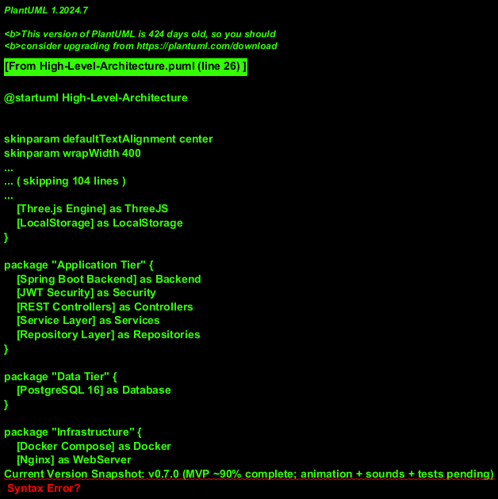

### 2.2 Deployment Architecture
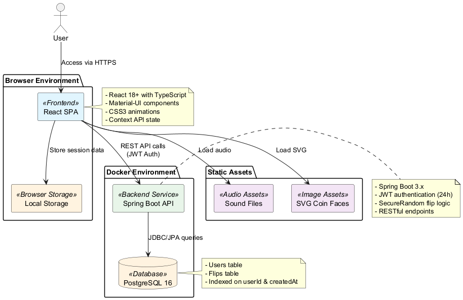

## 3. Backend Architecture

### 3.1 Backend Layer Architecture
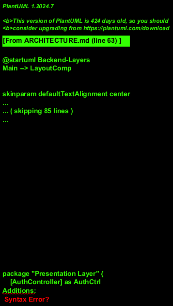

### 3.2 Domain Model
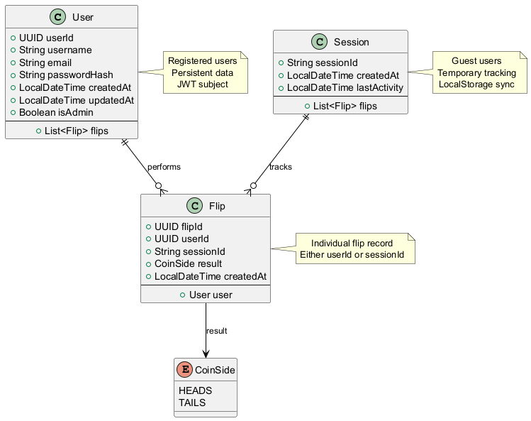

Layered (hexagonal tendencies) separation to enforce clear responsibilities.

| Layer | Responsibility | Notes |
|-------|----------------|-------|
| Controller | HTTP endpoints, request/response mapping | Uses DTOs, returns ResponseEntity |
| Service | Business logic (flip generation, stats aggregation) | Stateless, transactional methods where needed |
| Repository | Data persistence via Spring Data JPA | Entities mapped with Hibernate annotations |
| Model (Entity) | Database schema representation | UUID primary keys, timestamps auto-managed |
| DTO | API contract objects | Prevents leaking internal entity structure |
| Security | JWT filter, authentication manager, password encoding | 24h token expiry, BCrypt hashing |
| Config | CORS, Jackson, Swagger/OpenAPI (future) | Externalized via `application.yml` |

### Request Lifecycle
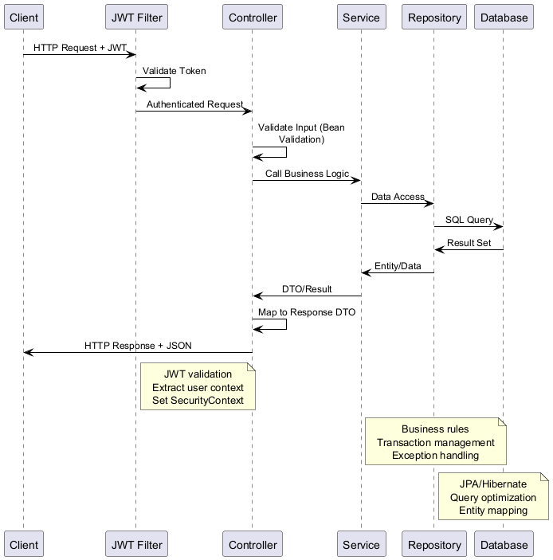

1. Request enters via Controller.
2. Authentication filter validates JWT (if protected endpoint).
3. Controller validates (Bean Validation) & converts payload to service arguments.
4. Service executes logic (e.g., generate coin flip result, compute stats).
5. Service interacts with Repository (CRUD / queries / pagination).
6. Response assembled in Controller (DTO mapping + status codes).

### Core Backend Flows

#### Flip Creation Flow
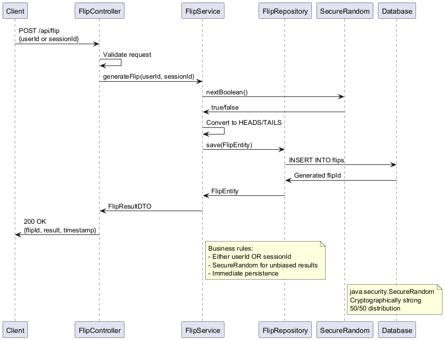

#### Statistics Aggregation Flow
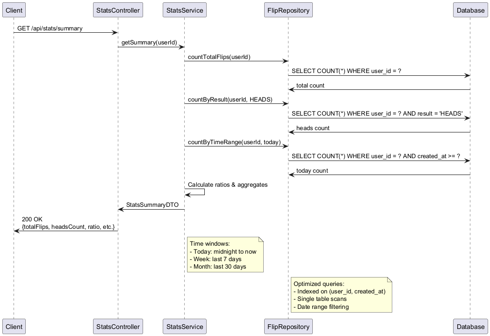

```
POST /api/flip
 -> (Optional JWT) -> FlipService.generateFlip(userId/sessionId)
 -> Randomization (SecureRandom) -> Persist FlipEntity -> Return DTO
```

```
GET /api/stats/summary
 -> Auth -> StatsService.getSummary(userId)
 -> Repository queries (counts grouped by time windows) -> Ratio calculations
 -> Return StatsSummaryDTO
```

### Persistence & Entities
```
UserEntity(userId UUID, username, email, passwordHash, isAdmin, createdAt)
FlipEntity(flipId UUID, userId?, sessionId?, result ENUM(HEADS,TAILS), createdAt)
```
Indexes:
- `(user_id, created_at DESC)` accelerates user history fetch
- `(session_id, created_at DESC)` for guest pagination

### Randomization Strategy
- Use `java.security.SecureRandom` (cryptographically strong) for unbiased HEADS/TAILS.
- Encapsulated in `FlipService` to allow future alternative RNG strategies.

## 4. Frontend Architecture

### 4.1 Frontend Component Architecture
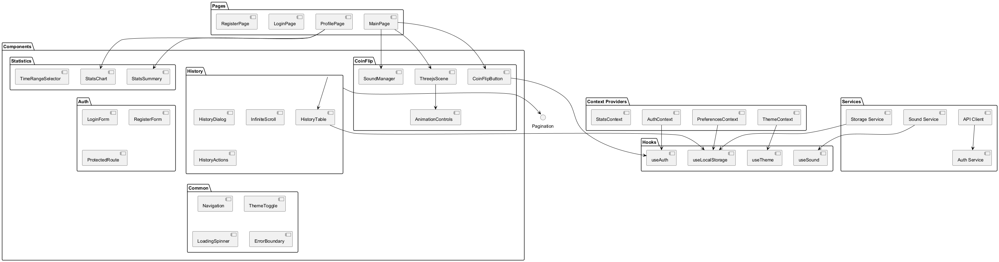

### 4.2 State Management Flow
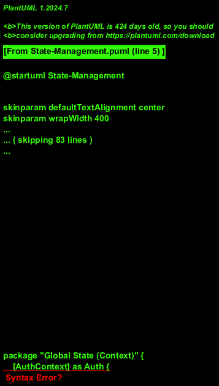

React + TypeScript organized by feature directories: `components/`, `pages/`, `services/`, `context/`, `hooks/`, `types/`.

### State Management
- Context Providers: `AuthContext`, `ThemeContext`, `PreferencesContext` (mute, skip animation), `StatsContext` (optional future).
- LocalStorage: guest flip history, theme, mute, skip toggle.

### Component Flow (Flip Interaction)
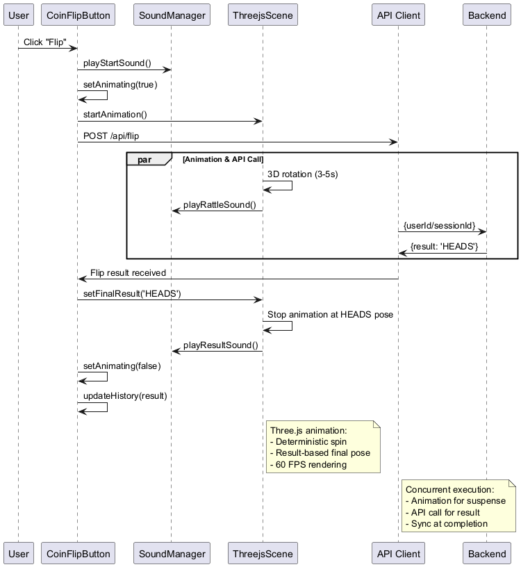

```
[FlipButton] ---> onClick -> play start sound -> setAnimating(true)
   |                              |
   v                              v
Three.js Coin Scene   (animation 3-5s) -> rattling sound -> final pose
   |                                         |
   +--> API POST /api/flip -------------------+
                 | result received | update history + stats | play result sound
```

### CSS3 Animation System (Current Implementation)
1. **Idle State**: Simple Y-axis rotation (180° alternating) with face switching at edge-on positions
2. **Flipping State**: 3D tumbling animation (rotateX + rotateY) with face alternation every 250ms
3. **Result Display**: Bounce reveal animation with scale and opacity transitions
4. **Custom SVG Faces**: Gold coin (heads) and silver coin (tails) with distinct designs
5. **Skip Animation**: Captured at flip initiation to prevent toggle interference

**Future Enhancement**: Three.js integration for advanced 3D coin models (post-MVP)

### API Service Layer
- `api.ts`: Axios instance (baseURL, interceptors for JWT, error handling).
- `auth.ts`: login, register, token storage.
- `storage.ts`: typed wrappers for LocalStorage keys.

### Routing & Components
- `MainPage` (flip UI, integrated HistoryDialog)
- `HistoryDialog` (modal with infinite scroll, dynamic height)
- `ProfilePage` (stats + user info with gradients and icons)
- `Auth` pages (login/register)

## 5. Data Flow Scenarios

### 5.1 Guest User Flow
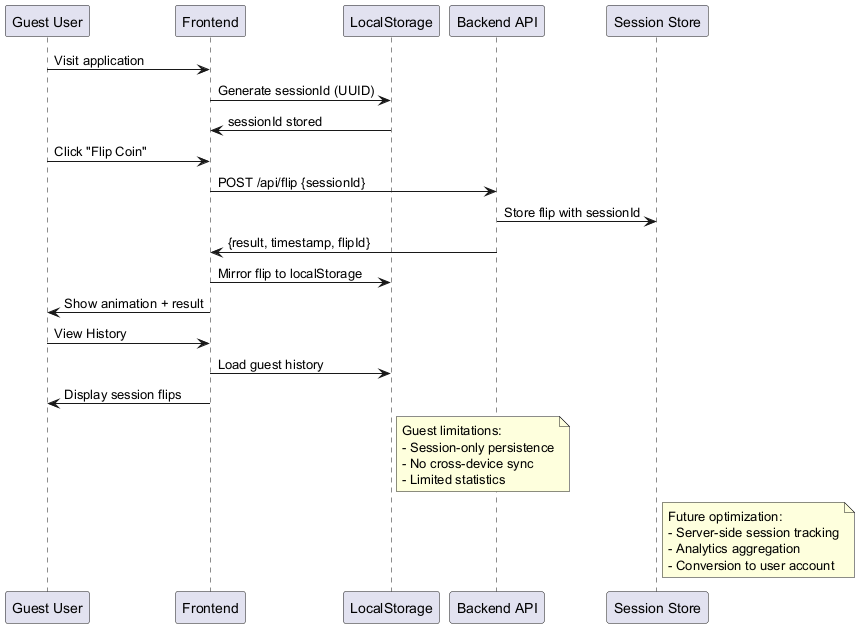

### 5.2 Registered User Flow
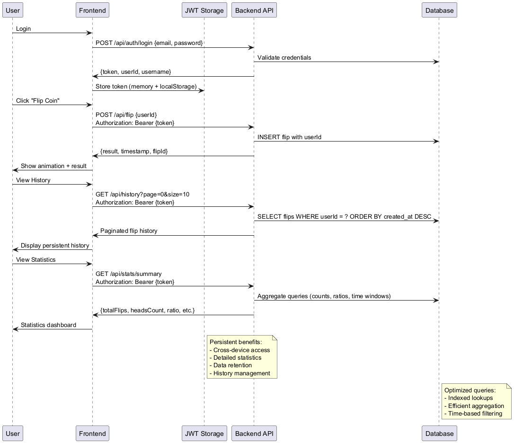

### Guest User
```
Flip -> POST /api/flip (sessionId) -> Persist flip with sessionId -> LocalStorage mirrors subset
History -> GET /api/history?sessionId (future optimization) OR unified endpoint filtering
Stats -> Simplified (total flips only) computed client-side (initial MVP) or server aggregated later
```

### Registered User
```
Login -> JWT stored (memory + optional LocalStorage)
Flip -> POST /api/flip (userId from token)
History -> GET /api/history?page&size (userId implicit from token)
Stats -> GET /api/stats/summary
Preferences -> Theme persisted server-side (future) else LocalStorage fallback
```

## 6. Deployment & Environments

### 6.1 Docker Compose Architecture
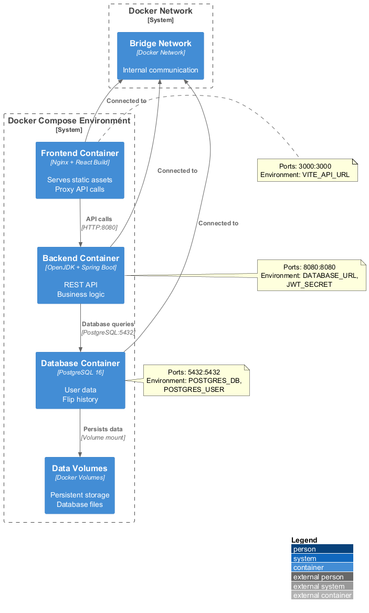

### Docker Compose Services (Planned)
```yaml
services:
  backend:
    build: ./backend
    ports: ["8080:8080"]
    env_file: .env.backend
    depends_on: [database]
  frontend:
    build: ./frontend
    ports: ["3000:3000"]
    env_file: .env.frontend
    depends_on: [backend]
  database:
    image: postgres:16
    environment:
      POSTGRES_DB: coinflip
      POSTGRES_USER: admin
      POSTGRES_PASSWORD: secret
    volumes: [pgdata:/var/lib/postgresql/data]
volumes:
  pgdata:
```

### Environments
| Env | Purpose | Notes |
|-----|---------|-------|
| Local Dev | Active coding | Hot reload FE/BE |
| Dev/Staging (future) | Integration testing | Seeded data, stricter CORS |
| Production (future) | Live usage | Hardened security headers, monitoring |

## 7. Cross-Cutting Concerns
| Concern | Implementation Plan |
|---------|---------------------|
| Logging | SLF4J + structured JSON (future) |
| Validation | Bean Validation (javax) + client-side form validation |
| Error Handling | Global `@ControllerAdvice` mapping to standard error JSON |
| Security | JWT filter chain, BCrypt hashing, CSRF off (stateless APIs) |
| Configuration | `application.yml` with profiles (`dev`, `prod`) |
| Metrics (future) | Micrometer + Prometheus/Grafana |
| Documentation | Markdown + potential OpenAPI spec generation |

## 8. Extensibility & Future Features
Roadmap items (WebSocket real-time, Admin dashboard, customization packs) are enabled by:
- Layered isolation (e.g., adding `NotificationService` without disrupting existing flows).
- DTO abstraction preventing contract churn.
- Clear separation of guest vs authenticated flows to allow conversion workflow.
- CSS3 animation system easily upgradeable to Three.js for advanced 3D models (post-MVP).

## 9. Architectural Decision Records (ADR Snapshot)
| Decision | Status | Rationale |
|----------|--------|-----------|
| React + TypeScript + Vite | Accepted | Fast dev, strong typing, modern tooling |
| Spring Boot + JPA | Accepted | Rapid backend productivity, mature ecosystem |
| PostgreSQL | Accepted | Relational schema with strong indexing + JSON (future) |
| JWT Auth | Accepted | Stateless scalability, client-managed tokens |
| Context API over Redux | Accepted | Simpler state needs in MVP |
| Three.js for 3D | Accepted | Rich WebGL abstraction, ecosystem size |

## 10. Potential Risks & Mitigations
| Risk | Impact | Mitigation |
|------|--------|-----------|
| RNG bias | Stats accuracy | Use SecureRandom + periodic test distribution |
| Large history pagination | Performance | DB indexes + page size caps (<=25) |
| Token theft | Account compromise | Short-lived tokens + future refresh tokens |
| Overfetch stats | Load | Aggregate queries, caching (future) |
| Asset bloat (sounds/models) | Load time | Lazy loading & compression |

## 11. Open Items
- OpenAPI auto-generation (swagger) not yet integrated.
- Metrics / Observability tooling pending.
- Server-side theme persistence TBD.

---
Last Updated: 2025-11-04
