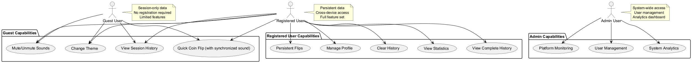
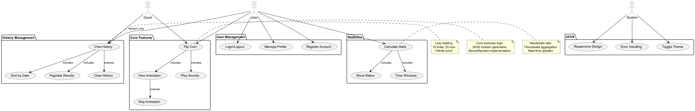
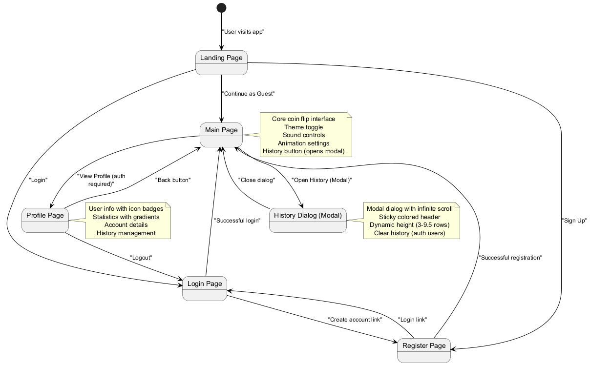
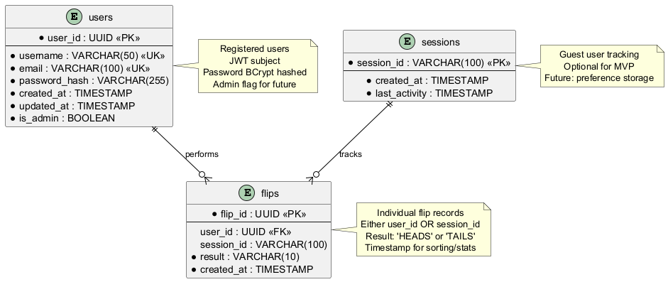

# Product Requirements Document (PRD)
## Coin Flip Application

**Version:** 1.0.1 (MVP Complete)  
**Last Updated:** November 5, 2025  
**Status:** 100% MVP Complete – All features, animation and sound fully integrated

---

## 1. Executive Summary

A web-based coin flip application that allows users to flip a virtual coin, track their flip history, and view statistics. The application supports both guest and registered users with persistent data storage.

---

## 2. Goals & Objectives

### Primary Goals
- Create an engaging coin flip experience with 3D animation and sound
- Provide detailed history and statistics tracking
- Learn full-stack development with modern tech stack
- Implement comprehensive testing strategies

### Success Metrics
- Smooth 3D animation (1 second, synchronized with coin-rattle.mp3)
- Sub-200ms API response time
- 90%+ test coverage (frontend & backend)
- Mobile-responsive design

---

## 3. User Personas

### 3.1 User Persona Overview


### Guest User
- **Needs:** Quick coin flip without registration
- **Limitations:** Session-only history, no persistence
- **Use Case:** One-time decision making

### Registered User
- **Needs:** Persistent history, detailed statistics
- **Benefits:** Cross-device access, data retention
- **Use Case:** Regular use, tracking patterns

### Future: Admin User
- **Access:** System-wide analytics, user management
- **Use Case:** Platform monitoring and moderation

---

## 4. Features & Requirements

### 4.1 Feature Use Case Diagram


### 4.2 Feature Implementation Status (MVP Scope)
| Feature Group | Item | Status | Notes |
|---------------|------|--------|-------|
| Core Flip | Random 50/50 result | ✅ Complete | SecureRandom in service |
| Core Flip | 3D Animation | ✅ Complete | CSS-based with custom SVG faces |
| Core Flip | Sound Effects | ✅ Complete | HTML5 Audio API, mute toggle |
| Preferences | Skip Animation | ✅ Complete | Session-based toggle |
| User Auth | Registration/Login | ✅ Complete | JWT 24h expiry |
| User Auth | Logout | ✅ Complete | Stateless client removal |
| User Profile | Basic Stats | ✅ Complete | Service aggregation |
| History | History Dialog (Modal) | ✅ Complete | Infinite scroll, dynamic height |
| History | Clear History | ✅ Complete | User & guest support |
| Statistics | Period Stats (today/week/month) | ✅ Complete | /api/stats/summary endpoint |
| Statistics | User Info with Icons | ✅ Complete | Gradient headers and badges |
| Statistics | Extended Timeline | 💤 Deferred | Post-MVP phase |
| UI/UX | Light/Dark Theme | ✅ Complete | Persistent preference |
| UI/UX | Responsive Layout | ✅ Complete | MUI + Layout component |
| UI/UX | Gradient Design | ✅ Complete | Headers, cards, visual hierarchy |
| UI/UX | Icon Badge System | ✅ Complete | Colored icons for data types |
| UI/UX | Component Sizing | ✅ Complete | Enhanced padding, responsive sizing |
| UI/UX | Accessibility Pass | 🔜 Pending | To review in polish |
| Testing | Backend Unit Tests | 🔜 Pending | Start after DTO sync |
| Testing | Frontend E2E Tests | 🔜 Pending | Playwright configured |
| Docs | UML Diagrams | ✅ Complete | 25+ diagrams across docs |
| Deployment | Docker Compose | ✅ Complete | Multi-service stack |

### 4.3 Out-of-Scope for MVP (Deferred)
- Real-time WebSocket updates
- Leaderboards & global statistics
- Admin moderation dashboard
- Export (CSV/JSON)
- Multiple chart visualizations
- Custom themes & coin skins
- Mobile app (React Native)
- Achievement/badge system

### 4.4 Core Features (Detailed FR List)

#### Coin Flip Interface
- **FR-001:** Single "Flip" button prominently displayed
- **FR-002:** 3D coin flip animation (3-5 seconds duration)
- **FR-003:** Random result generation (50/50 probability)
- **FR-004:** Display result clearly (Heads/Tails)

#### Sound Effects
- **FR-005:** Flip start sound (button click)
- **FR-006:** Coin rattling sound during animation
- **FR-007:** Result announcement sound
- **FR-008:** Mute/unmute toggle

#### Animation Control
- **FR-009:** Skip animation checkbox/toggle (positioned below flip button)
- **FR-010:** Setting persists during session only
- **FR-011:** Instant result display when skipped

#### Theme Support
- **FR-012:** Light theme (default)
- **FR-013:** Dark theme
- **FR-014:** Theme toggle button on main page
- **FR-015:** Theme preference saved per user (localStorage for guests)

### 4.5 History & Statistics

#### Flip History Dialog (Modal)
- **FR-020:** Table view with columns: Serial No, Result (Chips), Timestamp
- **FR-021:** Timestamp format: dd/mm/yyyy hh:mm:ss
- **FR-022:** Show 10 items initially, load more on scroll
- **FR-023:** Infinite scroll with seamless loading
- **FR-024:** Newest entries first with descending sort indicator
- **FR-025:** Dynamic height system (3-9.5 rows visible)
- **FR-026:** Guest: session-only history
- **FR-027:** User: persistent database history
- **FR-028:** Clear history button (user-specific, doesn't affect app-wide data)
- **FR-029:** Modal dialog pattern with auto-scroll to top

#### Statistics Dashboard (Profile Page)
- **FR-030:** Total flip count with gradient cards
- **FR-031:** Heads to Tails ratio display with colored Chips
- **FR-032:** Today's flip statistics (green border)
- **FR-033:** This week's flip statistics (blue border)
- **FR-034:** This month's flip statistics (purple border)
- **FR-035:** Guest: simplified stats (flip count only)
- **FR-036:** User info section with gradient header and icon badges
- **FR-037:** Back navigation button

### 4.6 User Management

#### Guest Mode
- **FR-040:** No login required
- **FR-041:** Session-based history in localStorage
- **FR-042:** Access to flip and history pages only

#### User Registration
- **FR-043:** Email/username field
- **FR-044:** Password field (min 8 characters)
- **FR-045:** Password confirmation
- **FR-046:** Email validation
- **FR-047:** Store: username, email, hashed password, registration date

#### User Login
- **FR-048:** Email/username + password authentication
- **FR-049:** JWT token generation
- **FR-050:** Session management
- **FR-051:** Logout functionality

#### User Profile
- **FR-052:** Display user details (username, email, join date)
- **FR-053:** Reset history button (clears user's flips only)
- **FR-054:** Statistics dashboard integration
- **FR-055:** Theme preference display

### 4.7 Navigation Structure

#### 4.4.1 Application Navigation Flow


- **Main Page:** Coin flip interface, theme toggle, history button (opens modal)
- **History Dialog:** Modal with infinite scroll, dynamic height, colored Chips
- **Profile Page:** User info with gradients, statistics, back navigation
- **Login/Register Pages:** Authentication forms

---

## 5. Technical Requirements

### 5.1 Frontend
- **Tech Stack:** React (latest), TypeScript
- **State Management:** Context API
- **UI Library:** Material-UI (MUI)
- **Animation:** Three.js
- **Testing:** Playwright with MCP integration
- **Build Tool:** Vite

### 5.2 Backend
- **Framework:** Spring Boot 3.x
- **Language:** Java 21
- **API:** RESTful
- **Authentication:** JWT
- **Testing:** JUnit 5, Mockito

### 5.3 Database
- **DBMS:** PostgreSQL 16
- **ORM:** Spring Data JPA / Hibernate

### 5.4 DevOps
- **Containerization:** Docker
- **Orchestration:** Docker Compose
- **CI/CD:** GitHub Actions (future)

---

## 6. API Endpoints (Implemented vs Pending)

### Authentication
- ✅ `POST /api/auth/register` - User registration
- ✅ `POST /api/auth/login` - User login (returns JWT)
- ✅ `POST /api/auth/logout` - User logout (client token discard)
- ✅ `GET /api/auth/validate` - Token validation

### Coin Flip
- ✅ `POST /api/flip` - Perform coin flip (user or guest)
    - Request: `{ userId?: string, sessionId?: string }`
    - Response: `{ result: 'HEADS' | 'TAILS', timestamp: string, flipId: string }`

### History
- ✅ `GET /api/history?page=0&size=10&sort=createdAt,desc` - Get flip history (user or guest)
    - Query params: `page`, `size`, `sort`
    - Response: Paginated flip results
- ✅ `DELETE /api/history` - Clear user or guest session history
- 🔜 `DELETE /api/history/{flipId}` - Delete specific flip (post-MVP)

### Statistics
- ✅ `GET /api/stats/summary` - Get user or guest statistics
    - Response: `{ totalFlips, headsCount, tailsCount, ratio, todayCount, weekCount, monthCount }`
- 🔜 `GET /api/stats/timeline?period=week` - Time-based stats (future)

### User Profile
- ✅ `GET /api/user/profile` - Get authenticated user details
- 🔜 `PUT /api/user/profile` - Update profile (post-MVP)

### Admin (Deferred)
- 🔜 `GET /api/admin/stats` - System-wide statistics
- 🔜 `GET /api/admin/users` - User management
- 🔜 `DELETE /api/admin/users/{userId}` - Delete user

### 6.1 Endpoint Implementation Notes
| Endpoint | Current State | Gap |
|----------|---------------|-----|
| /api/auth/* | Implemented | Add refresh tokens (future) |
| /api/flip | Implemented | DTO naming alignment (FlipRequest/FlipResponse) |
| /api/history | Implemented | Introduce HistoryResponse DTO |
| /api/stats/summary | Implemented | Rename SummaryResponse -> StatsResponse |
| /api/user/profile | Implemented | Add update endpoint |
| /api/admin/* | Deferred | Requires role-based security |

### 6.2 Pending DTO Tasks
- Create missing DTO classes (see `API.md` gap section)
- Introduce central error envelope after global exception handler
- Add OpenAPI annotations for Swagger generation (future)

---

## 7. Database Schema

### 7.1 Entity Relationship Diagram


### Users Table
```sql
CREATE TABLE users (
    user_id UUID PRIMARY KEY,
    username VARCHAR(50) UNIQUE NOT NULL,
    email VARCHAR(100) UNIQUE NOT NULL,
    password_hash VARCHAR(255) NOT NULL,
    created_at TIMESTAMP DEFAULT CURRENT_TIMESTAMP,
    updated_at TIMESTAMP DEFAULT CURRENT_TIMESTAMP,
    is_admin BOOLEAN DEFAULT FALSE
);
```

### Flips Table
```sql
CREATE TABLE flips (
    flip_id UUID PRIMARY KEY,
    user_id UUID REFERENCES users(user_id),
    session_id VARCHAR(100), -- For guest users
    result VARCHAR(10) NOT NULL, -- 'HEADS' or 'TAILS'
    created_at TIMESTAMP DEFAULT CURRENT_TIMESTAMP,
    INDEX idx_user_created (user_id, created_at DESC),
    INDEX idx_session_created (session_id, created_at DESC)
);
```

### Sessions Table (Optional - for guest tracking)
```sql
CREATE TABLE sessions (
    session_id VARCHAR(100) PRIMARY KEY,
    created_at TIMESTAMP DEFAULT CURRENT_TIMESTAMP,
    last_activity TIMESTAMP DEFAULT CURRENT_TIMESTAMP
);
```

---

## 8. Non-Functional Requirements

### Performance
- **NFR-001:** API response time < 200ms (95th percentile)
- **NFR-002:** Page load time < 2 seconds
- **NFR-003:** Animation runs at 60 FPS

### Security
- **NFR-010:** Passwords hashed with bcrypt
- **NFR-011:** JWT tokens expire after 24 hours
- **NFR-012:** HTTPS in production
- **NFR-013:** SQL injection prevention
- **NFR-014:** XSS protection

### Scalability
- **NFR-020:** Support 100 concurrent users initially
- **NFR-021:** Database connection pooling
- **NFR-022:** Pagination for all list endpoints

### Reliability
- **NFR-030:** 99% uptime target
- **NFR-031:** Graceful error handling
- **NFR-032:** Database backups (future)

### Usability
- **NFR-040:** Mobile-responsive design (viewport: 320px+)
- **NFR-041:** Accessible (WCAG 2.1 Level AA - future)
- **NFR-042:** Cross-browser compatibility (Chrome, Firefox, Safari, Edge)

---

## 9. Future Features (Roadmap)

### Phase 2
- WebSocket real-time updates
- Advanced filtering (date range, result type)
- Custom themes and color schemes
- Export history (CSV/JSON)
- Multiple chart options for statistics

### Phase 3
- Admin dashboard
- System-wide analytics
- User management features
- Guest to user conversion
- Social features (leaderboards)

### Phase 4
- Mobile app (React Native)
- Coin customization
- Multiple coin types (D6, D20, etc.)
- Achievements and badges

---

## 10. Testing Strategy

### Frontend Testing (Playwright)
- **Unit Tests:** Component logic, utilities
- **Integration Tests:** User flows, API integration
- **E2E Tests:** Complete user journeys
- **Visual Tests:** Screenshot comparison (future)

### Backend Testing (JUnit)
- **Unit Tests:** Service layer, utilities
- **Integration Tests:** Repository, API endpoints
- **Contract Tests:** API schema validation

### Coverage Goals
- Frontend: 85%+ code coverage
- Backend: 90%+ code coverage

---

## 11. Open Questions & Decisions

- [x] Choose UI library: Material-UI ✅
- [x] State management: Context API ✅
- [x] Animation library: Three.js ✅
- [x] Frontend build tool: Vite ✅
- [ ] Sound file sources (royalty-free) - To be provided
- [ ] Docker base images selection

---

## 12. Assumptions & Constraints

### Assumptions
- Users have modern browsers (ES6+ support)
- Stable internet connection required
- Users accept cookies (for session management)

### Constraints
- Learning project - not production-critical
- Single developer timeline
- Free-tier database limitations initially

---

## 13. Success Criteria

✅ **Launch Ready When:**
1. All FR-001 to FR-055 implemented
2. 85%+ test coverage achieved
3. Docker Compose setup working
4. Documentation complete
5. No critical bugs

---

**Document Owner:** Project Lead  
**Reviewers:** N/A (Learning Project)  
**Next Review:** After MVP completion
