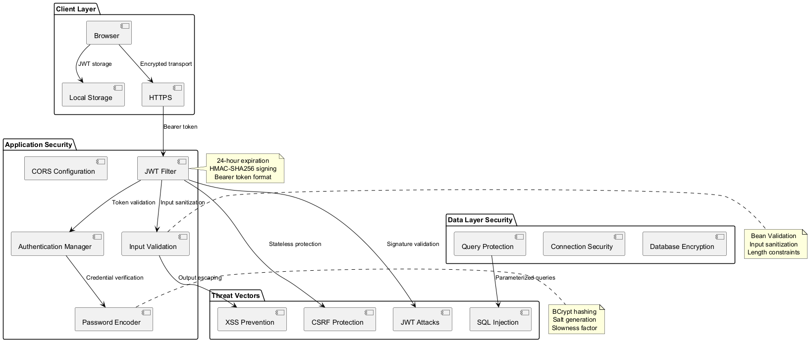
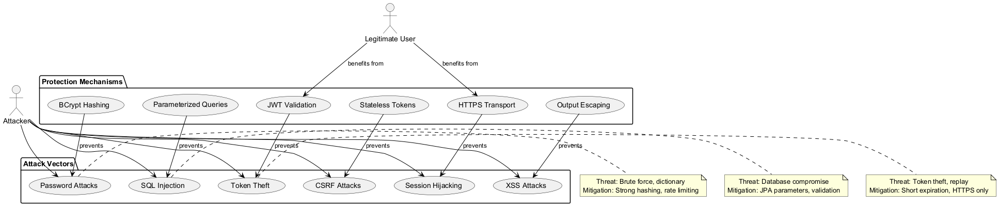
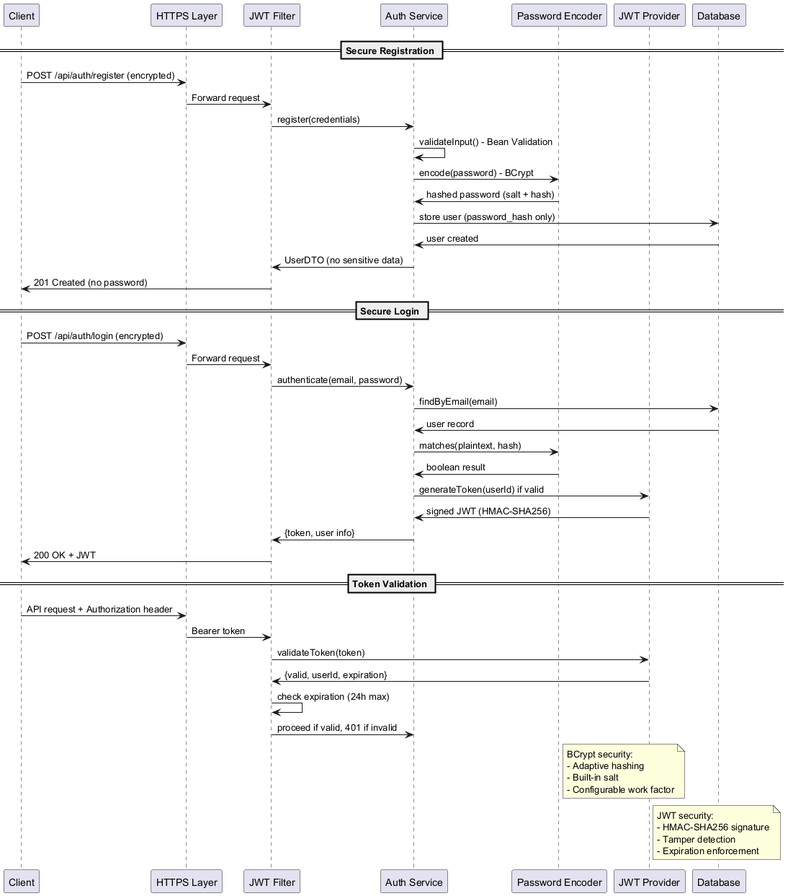

# Coin Flip Application Security Guidelines

## 1. Security Overview

### 1.1 Security Architecture Diagram


### 1.2 Threat Model Overview


Goal: Provide a secure foundation for user authentication, data integrity, and future administrative capabilities while keeping MVP lightweight.

### Related Documents
- **Architecture**: `ARCHITECTURE.md` (placement of security filters & data flow).
- **API**: `API.md` (auth-required endpoints & error codes).
- **Testing**: `TESTING.md` (security test cases: JWT expiry, invalid token, protected routes).
- **Requirements**: `PRD.md` (functional security expectations e.g., guest vs user modes).
- **Roadmap**: `ROADMAP.md` (future MFA, admin role expansion, rate limiting).
- **Status**: `STATE.md` (current phase & pending security tasks).

Security posture evolves iteratively—items marked "Future" here should appear as planned features in `ROADMAP.md` and gain test coverage outlined in `TESTING.md` once implemented.

## 1. Security Principles
| Principle | Application |
|-----------|------------|
| Least Privilege | Users have only basic flip/history/statistics access; admin features gated (future). |
| Defense in Depth | Input validation, password hashing, JWT auth, DB constraints, logging. |
| Secure by Default | No sensitive data exposed; passwords never logged. |
| Fail Securely | Invalid tokens produce 401; malformed input returns 400 without leaking internals. |
| Observability (future) | Centralized audit trails for auth & critical actions. |

## 2. Authentication & Authorization

### 2.1 Authentication Flow Security


- Auth Type: JWT (stateless) with 24h expiration (`JWT_EXPIRATION`).
- Claims: `sub` (userId), `iat`, `exp`, roles (future `roles: ["ADMIN"]`).
- Authorization: Filter chain checks `Authorization` header; endpoints annotated with role constraints (future `@PreAuthorize`).
- Logout: Client-side token discard (no server state) until refresh tokens are introduced.

### Password Handling
- Library: BCrypt (Spring Security `BCryptPasswordEncoder`).
- Policy (MVP): Min length 8, future: complexity (uppercase, digits, symbols) & breach list check.
- Storage: `password_hash` only; no reversible passwords.

### Token Lifecycle
| Aspect | MVP | Future |
|--------|-----|--------|
| Expiration | 24h fixed | Rotating refresh + short access tokens |
| Revocation | Manual (change secret) | Server-side blacklist / Redis cache |
| Transport | HTTPS required (prod) | Same |

## 3. Input Validation & Sanitization
- Backend: Bean Validation annotations (e.g., `@Email`, `@Size`).
- Frontend: Client-side preliminary validation for UX (not security boundary).
- SQL Injection: Prevented by JPA parameter binding.
- XSS: No raw HTML injection; React escapes output. Future: sanitize user-generated content if added.

## 4. Data Protection
| Data | Protection |
|------|-----------|
| Passwords | BCrypt hashed |
| JWT Secret | Stored outside VCS (`JWT_SECRET` in env/config) |
| PII (email) | Limited usage, not logged |
| Session flips (guest) | No sensitive link to identity |

## 5. CORS Policy
- Dev: Permissive (`http://localhost:3000`).
- Prod (future): Restrict to known origins, disallow credentials.

## 6. Secure Headers (Future)
Planned via Spring Security config:
| Header | Purpose |
|--------|--------|
| `Content-Security-Policy` | Prevent inline script injection |
| `Strict-Transport-Security` | Force HTTPS |
| `X-Frame-Options` | Clickjacking protection |
| `X-Content-Type-Options` | MIME sniffing prevention |
| `Referrer-Policy` | Limit referrer leakage |

## 7. Secrets Management
| Secret | Location (Dev) | Future Production |
|--------|----------------|------------------|
| DB Credentials | `.env` / `application-dev.yml` | Vault / Secret Manager |
| JWT Secret | `.env` / `application-dev.yml` | Vault / KMS |
| API Keys (future) | N/A | Vault / Rotated |

Secrets must never be committed. `.gitignore` excludes typical env files.

## 8. Dependency & Supply Chain Security
- Use pinned versions where feasible.
- Regular audit (future): `npm audit`, OWASP Dependency Check, Snyk.
- Remove unused dependencies promptly.

## 9. OWASP Top 10 Mapping (MVP Coverage)
| Risk | Status | Mitigation |
|------|--------|-----------|
| A01 Broken Access Control | Partial | Role-based endpoints (future) |
| A02 Cryptographic Failures | Covered | Proper hashing, secure random |
| A03 Injection | Covered | JPA parameter binding |
| A04 Insecure Design | In Progress | Documented flows, layered arch |
| A05 Security Misconfiguration | Partial | Profiles, env separation |
| A06 Vulnerable Components | Planned | Dependency scanning |
| A07 Auth / ID Failures | Partial | JWT + password policies |
| A08 Software/Data Integrity | Future | Signed artifacts / CI controls |
| A09 Logging & Monitoring | Future | Centralized structured logging |
| A10 SSRF | N/A | No server-side external fetches |

## 10. Threat Model (MVP)
| Asset | Threat | Actor | Mitigation |
|-------|--------|-------|-----------|
| User credentials | Brute-force | External attacker | Rate limit (future), strong hashing |
| JWT tokens | Theft | Malicious script | HTTPS, short expiry future, secure storage |
| Flip history | Enumeration | Curious user | Auth required for user history, session isolation |
| Stats endpoints | Abuse | Automated scraping | Rate limiting (future) |

## 11. Logging & Monitoring (Future)
- Structured JSON logs.
- Include correlation ID per request.
- Audit events: login success/failure, account creation, history clear.
- Integration with ELK / OpenTelemetry.

## 12. Error Handling & Information Leakage
- No stack traces returned to clients.
- Generic 500 responses with correlation ID.
- Validation errors list only offending fields.

## 13. Secure Development Practices
| Practice | Application |
|----------|------------|
| Code Review | Mandatory PRs |
| Static Analysis | Lint + Typescript strict mode |
| Dependency Review | Manual per upgrade cycle |
| Secrets Scan | (Future) Git hooks / CI scan |

## 14. Future Enhancements
- Refresh tokens & rotation.
- Account lockout after repeated failed logins.
- Email verification flow.
- MFA (TOTP) for admin accounts.
- Role-based access control (RBAC) for admin endpoints.
- Rate limiting (bucket4j + Redis).
- CSP policy & security header hardening.
- Automated dependency vulnerability scanning.

## 15. Open Items
- Confirm BCrypt cost factor (default vs tuned for production).
- Decide on HSTS, CSP config prior to production deploy.
- Establish secret rotation schedule.

---
## 16. Current Implementation Snapshot (v0.7.0)
| Aspect | Implemented | Pending |
|--------|-------------|---------|
| JWT Auth (24h) | ✅ | Refresh/rotation, blacklist |
| Password Hashing (BCrypt) | ✅ | Strength policy & breach list check |
| Input Validation (Bean Validation) | ✅ | Centralized error envelope |
| Global Exception Handling | 🔜 | ControllerAdvice + ErrorEnvelope DTO |
| Rate Limiting | 🔜 | Bucket4j/Redis integration |
| Role-Based Access Control | 🔜 | Admin endpoints (post-MVP) |
| Secure Headers | 🔜 | CSP, HSTS, frame/x-content options |
| Logging & Audit | 🔜 | Structured JSON + correlation IDs |
| Token Revocation | 🔜 | Secret rotation schedule / refresh tokens |
| Guest Session Migration | 🔜 | Convert session flips to user on signup |

### Immediate Pre-MVP Security Tasks
1. Implement global exception handler returning standardized error envelope.
2. Add DTO alignment (StatsResponse, FlipResponse) to reduce internal data exposure.
3. Confirm BCrypt strength factor (cost) configuration (document default used).
4. Add negative tests: expired token, malformed token, missing Bearer prefix.

### Near-Term (Post-MVP Fast-Follow)
- Introduce refresh tokens (short-lived access tokens + rotation strategy).
- Add basic rate limiting on auth + flip endpoints.
- Harden CORS for production domain.
- Implement security headers via Spring Security config.

### Longer-Term Enhancements
- MFA for admin users.
- Suspicious activity detection (multiple failed logins -> temporary lockout).
- Centralized audit trail with tamper-evident storage.
- Automated dependency vulnerability scanning (OWASP / Snyk) in CI.

### Risk & Mitigation Snapshot
| Risk | Current Mitigation | Planned Upgrade |
|------|--------------------|-----------------|
| Token Theft | HTTPS + 24h expiry | Short-lived + refresh rotation |
| Excessive Flip Spam | Size caps, pagination | Rate limiting + anomaly alerts |
| Sensitive Data Exposure | DTO usage | Error envelope + review logging scope |
| Brute Force Login | BCrypt hashing | Rate limiting + lockout policy |
| RNG Bias | SecureRandom | Statistical monitoring test harness |

### Security Test Checklist (To Add in TESTING.md)
- Auth: valid/invalid credentials, token expiry.
- Authorization: protected endpoints reject missing/invalid token.
- Input validation: registration rejects invalid email/short password.
- Error handling: consistent JSON envelope (after handler added).

**Version:** 1.0.1 (MVP Complete)  
**Last Updated:** November 5, 2025

```
