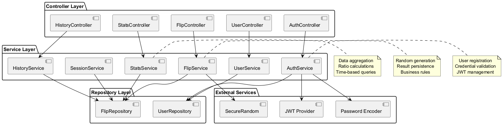
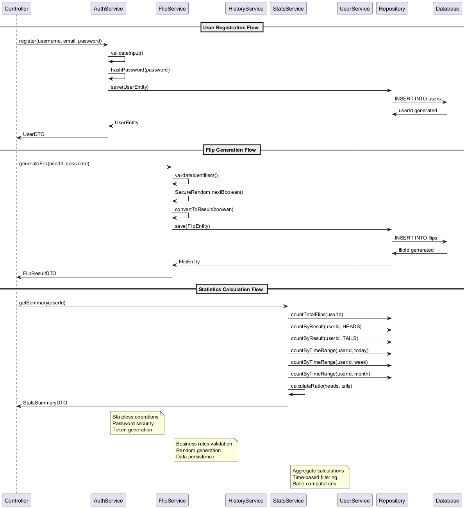
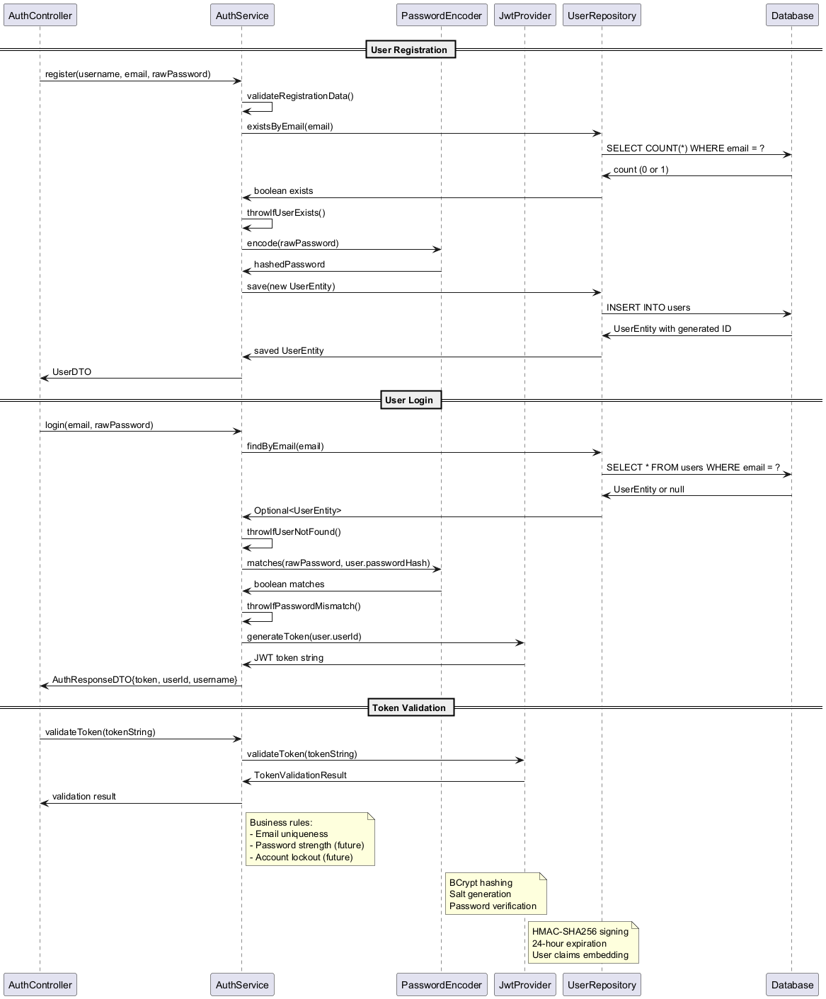
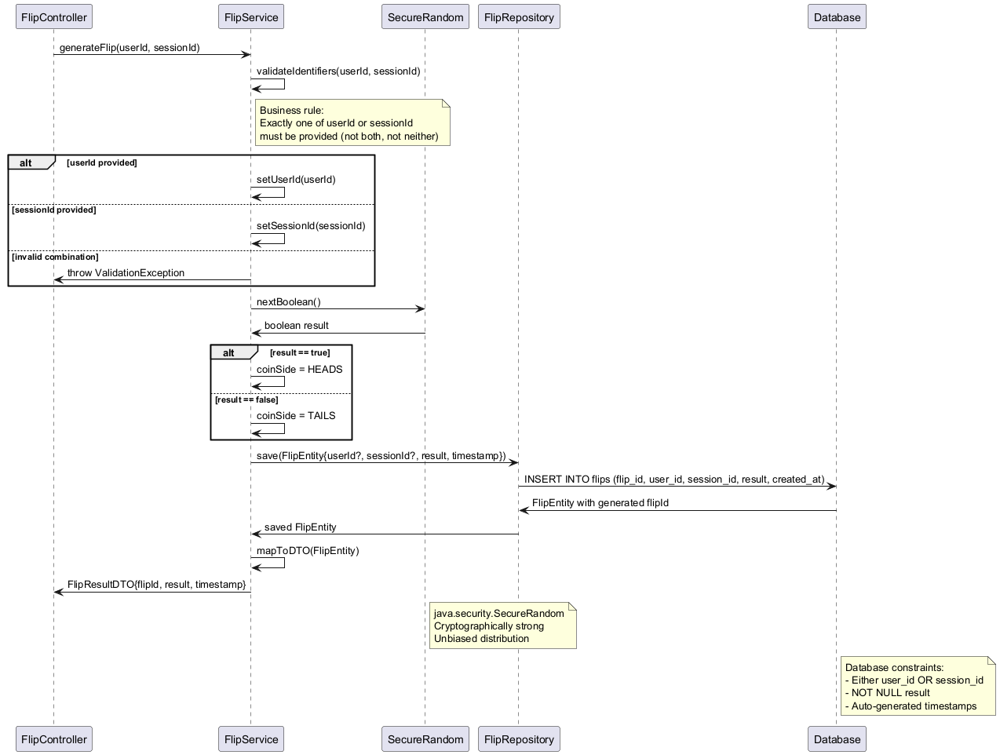
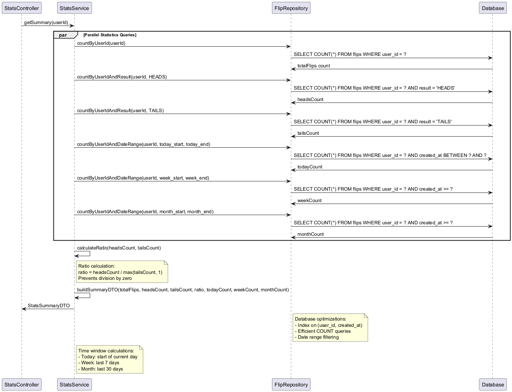

# Coin Flip Application Service Layer Reference

## 1. Overview

### 1.1 Service Architecture Diagram


This document describes the backend service-layer components, their responsibilities, primary methods, and cross-references to other documentation (`API.md`, `ARCHITECTURE.md`, `TESTING.md`, `SECURITY.md`, `PRD.md`). It helps maintain separation of concerns and guides test coverage.

## 1. Overview
## 1. Overview

### 1.2 Service Interaction Flow


Services encapsulate business logic independent of web / persistence frameworks. Controllers delegate to services; repositories abstract storage. Each service:
- Is stateless (except caching layers in future)
- Uses constructor injection
- Returns DTOs or domain objects mapped upward
- Throws custom exceptions (e.g., `NotFoundException`, `ValidationException`) mapped by a global error handler

## 2. Service Catalog (MVP)
| Service | Responsibility | Key Interactions | Related Docs |
|---------|----------------|------------------|--------------|
| AuthService | Registration, login, JWT creation/validation | UserRepository, JwtProvider | API.md: /auth/*, SECURITY.md |
| UserService | User profile retrieval & future update | UserRepository | API.md: /user/profile, PRD.md |
| FlipService | RNG coin flip generation & persistence | FlipRepository, SecureRandom | API.md: /flip, ARCHITECTURE.md |
| HistoryService | Paginated history retrieval & clearing | FlipRepository | API.md: /history, TESTING.md |
| StatsService | Aggregate statistics (counts, ratio, time windows) | FlipRepository (custom queries) | API.md: /stats/summary, ARCHITECTURE.md |
| SessionService (lightweight) | Guest session id validation (future expansion) | FlipRepository (session queries) | PRD.md guest mode |

Future (Roadmap): `AdminService`, `NotificationService` (WebSockets), `ExportService` (CSV/JSON), `ThemeService` (persisted preferences).

## 3. AuthService

### 3.1 Authentication Service Flow


Responsibilities:
- Register new users (validation + password hashing)
- Authenticate credentials and issue JWT
- Validate tokens (signature, expiration)

Key Methods (Conceptual Signature):
```
register(username: String, email: String, rawPassword: String): UserDTO
login(email: String, rawPassword: String): AuthResponseDTO
validateToken(token: String): TokenValidationResult
hashPassword(raw: String): String
verifyPassword(raw: String, hash: String): boolean
```
Security Notes: See `SECURITY.md` (BCrypt, token expiration 24h, future refresh tokens).
Tests: `TESTING.md` (AuthControllerTest, password policy cases).

## 4. UserService
Responsibilities:
- Fetch user profile by authenticated principal
- Future: update profile fields (except password — separate flow)

Key Methods:
```
getProfile(userId: UUID): UserProfileDTO
updateProfile(userId: UUID, changes: UpdateProfileRequest): UserProfileDTO (future)
```
Validation: Only owned profile; admin override (future).
Edge Cases: Non-existent user -> NotFoundException.

## 5. FlipService

### 5.1 Flip Generation Flow


Responsibilities:
- Generate unbiased HEADS / TAILS using SecureRandom
- Persist flip record with userId or sessionId
- Return result DTO

Key Methods:
```
generateFlip(userId: UUID | null, sessionId: String | null): FlipResultDTO
private randomSide(): CoinSide (HEADS | TAILS)
```
Constraints:
- Must supply either userId or sessionId (PRD requirement).
- Random distribution monitored via test (see `TESTING.md`).
Performance: Single insert; negligible CPU.

## 6. HistoryService
Responsibilities:
- Retrieve paginated user flip history (sorted desc by timestamp)
- Clear user history (soft delete not needed for MVP)

Key Methods:
```
getHistory(userId: UUID, page: int, size: int, sort: SortSpec): Page<FlipDTO>
clearHistory(userId: UUID): void
```
Pagination Limits: `size <= 25` enforced.
Errors: Unauthorized access to another user's history (future role checks).

## 7. StatsService

### 7.1 Statistics Calculation Flow


Responsibilities:
- Aggregate counts: total, heads, tails
- Compute ratio `headsCount / max(tailsCount,1)`
- Time windows: today, week, month

Key Methods:
```
getSummary(userId: UUID): StatsSummaryDTO
private countByRange(userId: UUID, start: Instant, end: Instant): long
```
Query Strategy: Using repository methods or custom JPQL. Consider DB date trunc functions (with portability caution).
Edge Cases: Zero flips -> ratio defaults to 0 or 1 (define in DTO spec; current: headsCount / (tailsCount == 0 ? 1 : tailsCount)).

## 8. SessionService (Future Scope)
Responsibilities:
- Validate guest sessionId format
- Track ephemeral preferences (theme, skip animation) once moved server-side
- Potential conversion guest -> user preserving history

Key Methods (planned):
```
validateSession(sessionId: String): boolean
migrateSessionToUser(sessionId: String, userId: UUID): int (migrated flip count)
```

## 9. Exception Mapping
Custom exceptions propagate upward:
| Exception | Meaning | HTTP Code | Example Trigger |
|-----------|--------|-----------|-----------------|
| ValidationException | Input fails business rule | 400 | Both userId and sessionId provided |
| AuthenticationException | Invalid login/token | 401 | Wrong password |
| AuthorizationException | Access to protected resource denied | 403 | Non-admin hitting admin endpoint (future) |
| NotFoundException | Resource not found | 404 | User not found |
| ConflictException | Duplicate or conflicting state | 409 | Email already registered |
| InternalErrorException | Unexpected condition | 500 | RNG failure (rare) |

Global handler defined at controller layer (planned) returning `API.md` error envelope.

## 10. Cross-Cutting Concerns
| Concern | Implementation | Future Enhancements |
|---------|----------------|---------------------|
| Logging | Service start/end (debug) | Structured JSON + correlation IDs |
| Metrics | Basic counters (future Micrometer) | Prometheus/Grafana dashboards |
| Tracing | None (MVP) | OpenTelemetry instrumentation |
| Validation | Bean Validation + manual service rules | Central validator patterns |
| Caching | None | Introduce caching for heavy stats queries |

## 11. Testing Alignment
Mapping from services to tests (`TESTING.md`):
| Service | Unit | Integration | API/E2E |
|---------|------|------------|---------|
| AuthService | Password hash/verify | Registration flow persists | Register/Login journey |
| UserService | Profile retrieval edge cases | Repo find vs missing | Profile page load |
| FlipService | Random distribution & persistence | Entity saved with correct fields | Flip action triggers history update |
| HistoryService | Pagination boundaries | Page sorting & limits | Infinite scroll loads more |
| StatsService | Ratio calc & zero flips | Aggregated counts correctness | Stats dashboard display |

## 12. Roadmap Extensions
| Future Service | Purpose | Dependency |
|----------------|---------|-----------|
| AdminService | System-wide analytics, user management | UserRepository, FlipRepository |
| ExportService | CSV / JSON export of history | FlipRepository |
| NotificationService | WebSocket push (live flips) | Messaging layer |
| ThemeService | Persist per-user theme | UserRepository |
| AchievementService | Gamification / badges | FlipRepository, StatsService |

## 13. Design Principles Recap
- Single Responsibility per service
- Explicit method contracts (DTO in/out)
- No business logic inside controllers/repositories
- Interface-driven (optional future for easy mocking)
- Clear error semantics

## 14. Open Items
- Decide on interface vs concrete class pattern (may adopt interfaces when >1 implementation).
- Establish custom query optimization for week/month stats if performance degrades.
- Evaluate caching layer viability after N users threshold.

---
## 15. Implementation Snapshot (v1.0.1)
| Service | Implemented | Notes |
|---------|-------------|-------|
| AuthService | ✅ Complete | Registration, login, JWT (24h) |
| UserService | ✅ Complete | Profile retrieval (update deferred) |
| FlipService | ✅ Complete | SecureRandom 50/50, persistence |
| HistoryService | ✅ Complete | Pagination + clear; DTO alignment pending |
| StatsService | ✅ Complete | Summary counts + time windows; DTO rename pending |
| SessionService | 📜 Planned | Guest session validation / migration future |
| AdminService | 💤 Deferred | Post-MVP roadmap (v2.0) |
| ExportService | 💤 Deferred | CSV/JSON post-MVP (v1.1) |
| NotificationService | 💤 Deferred | WebSocket real-time updates (v1.2) |
| ThemeService | 💤 Deferred | Persisted preferences (v1.3) |

### Pending DTO Tasks (Cross-Reference `API.md`)
- Introduce FlipRequest / FlipResponse DTO classes (ensure controller not leaking entities).
- Add HistoryResponse DTO for paginated results (replace generic list mapping).
- Rename StatsSummaryDTO -> StatsResponse for consistency.
- Add unified ErrorEnvelope DTO once GlobalExceptionHandler is added.

### Immediate Test Priorities (Pre-MVP)
1. FlipService distribution sanity (heads vs tails difference < 3% over 10k flips).
2. AuthService password hashing & validation edge cases.
3. HistoryService pagination boundaries (size cap 25 enforced).
4. StatsService zero-flip edge case ratio handling.
5. UserService profile retrieval unauthorized access prevention (negative test).

### Refactoring / Hardening Backlog
- Centralize time window calculations with Clock abstraction for deterministic tests.
- Extract repository aggregation queries into custom interface for clarity.
- Introduce interfaces (IAuthService, etc.) only if multiple implementations emerge.
- Evaluate caching layer for StatsService when flip volume increases.

### Risk Watchlist
| Risk | Area | Mitigation Plan |
|------|------|-----------------|
| DTO leak | Controller returns entity fields | Enforce DTO mapping layer |
| Performance | Stats multiple count queries | Batch / aggregated query optimization |
| Random bias | FlipService RNG misuse | Keep SecureRandom encapsulated + test guard |
| Pagination misuse | Large size param | Validate & cap size (already enforced) |

**Version:** 1.0.1 (MVP Complete)  
**Last Updated:** November 5, 2025

````
