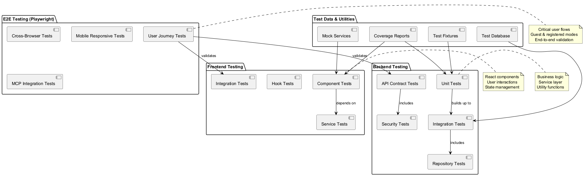
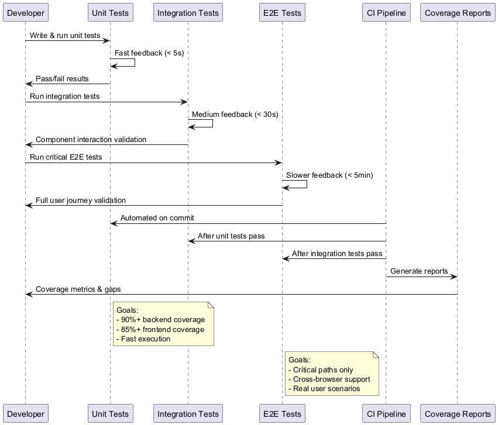
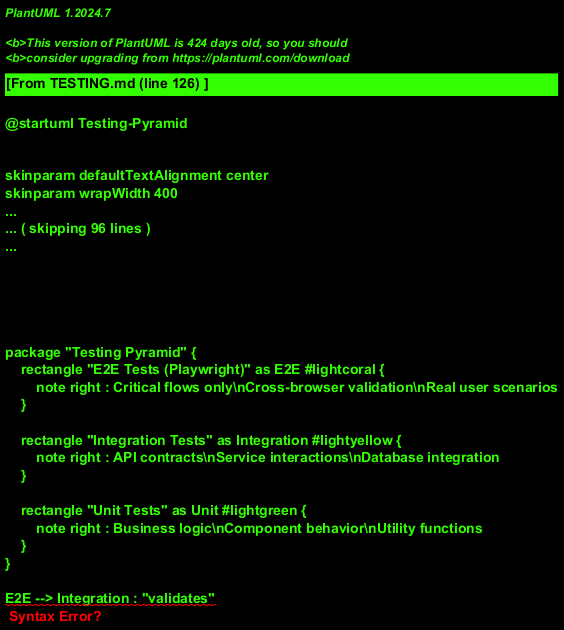
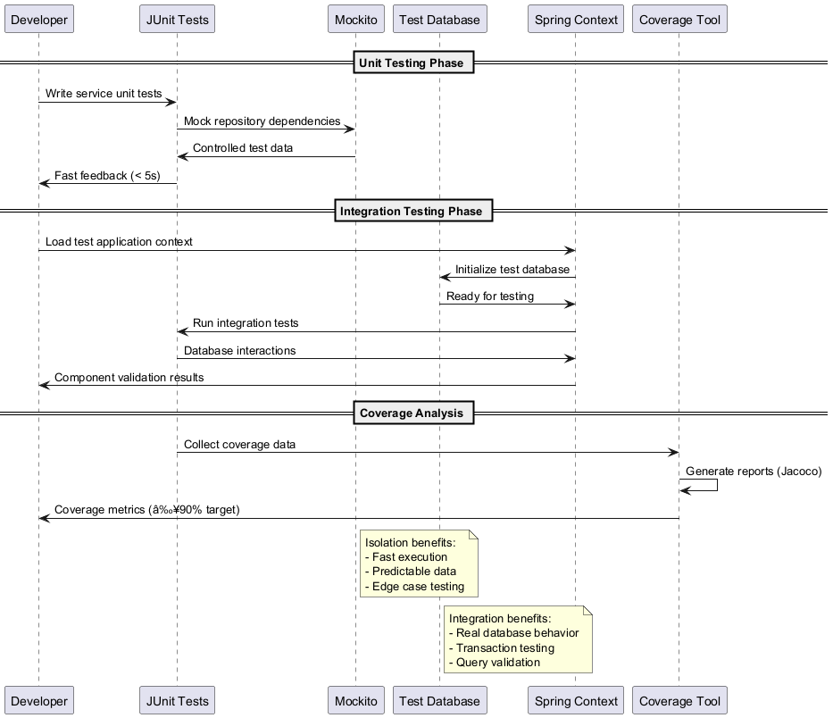

# Coin Flip Application Testing Strategy

## 1. Testing Overview

### 1.1 Testing Architecture Diagram


### 1.2 Test Strategy Flow


Goal: Maintain reliability, correctness, and performance with high coverage targets (Backend ≥90%, Frontend ≥85%). Current coverage: 0% (harness pending in final MVP sprint).

### Related Documents
- **Architecture**: `ARCHITECTURE.md` (layers & flows informing test boundaries).
- **API**: `API.md` (request/response schemas for contract & E2E tests).
- **Security**: `SECURITY.md` (auth scenarios, negative token cases, password rules).
- **Requirements**: `PRD.md` (derives test cases & acceptance coverage mapping).
- **Status**: `STATE.md` (progress metrics; can integrate with CI reporting later).
- **Roadmap**: `ROADMAP.md` (upcoming features to pre-plan test harness extension).

Traceability: Each major feature in `PRD.md` should map to at least one unit/integration and (where user-facing) one E2E test scenario.

## 2. Testing Pyramid (Adjusted)

### 2.1 Testing Pyramid Visualization


```
           +-----------------------+
           |  E2E (Playwright)     |  Critical flows only
           +-----------+-----------+
               Integration / API      Backend services + repository + security
           +-----------+-----------+
               Unit (Backend/FE)      Logic, helpers, components
           +-----------------------+
```
Emphasis on fast unit tests; focused integration tests; minimal but high-value E2E scenarios.

## 3. Backend Testing

### 3.1 Backend Testing Flow


### Tools
- JUnit 5 (platform & tagging)
- Mockito (mocking dependencies)
- Testcontainers (future for isolated PostgreSQL)
- Jacoco (coverage reports)

### Types
| Type | Scope | Examples |
|------|-------|----------|
| Unit | Pure logic | FlipService random result, StatsService ratio calc |
| Integration | Spring context + DB | Repository pagination, entity mappings |
| API / Contract | Controller layer | /api/flip returns proper schema |
| Security | JWT validation | Expired token rejection |
| Performance (future) | Load patterns | Flip endpoint under burst traffic |

### Sample Unit Test Cases
FlipServiceTest
- `shouldReturnHeadsOrTailsRandomly()` (distribution sanity check over N flips)
- `shouldPersistFlipWithUserId()`
- `shouldPersistFlipWithSessionId()`

StatsServiceTest
- `shouldCalculateHeadsTailsRatio()`
- `shouldHandleZeroFlips()`
- `shouldAggregateTodayWeekMonthCounts()`

### Integration Test Cases
UserRepositoryTest
- `shouldFindByEmail()`
- `shouldPreventDuplicateEmail()`

FlipRepositoryTest
- `shouldPaginateUserFlipsDescending()`
- `shouldReturnLimitedPageSize()`

### API Layer Tests
AuthControllerTest
- `registerShouldCreateUser()`
- `loginShouldReturnJwt()`
- `loginShouldFailWithInvalidPassword()`

FlipControllerTest
- `flipShouldReturnValidResult()`
- `guestFlipShouldStoreSessionId()`

HistoryControllerTest
- `historyShouldRespectPagination()`
- `clearHistoryShouldDeleteUserFlips()`

StatsControllerTest
- `summaryShouldReturnAllFields()`

### Security Tests
- Invalid token -> 401
- Missing token for protected route -> 401
- Malformed token -> 401

### Test Data Strategy
- Use builders for DTOs and Entities.
- Avoid fragile fixed timestamps; use clock abstraction (future) for deterministic time-based tests.
- Clear DB state per test class (transactional rollback or Testcontainers fresh instance).

### Coverage Generation
```
mvn test jacoco:report
```
Output: `target/site/jacoco/index.html`

## 3. Frontend Testing
### Tools
- Vitest / Jest (unit + component tests) (depending on chosen stack)
- React Testing Library (DOM-focused component tests)
- Playwright (E2E + visual regression future)

### Testing Layers
| Layer | Purpose | Examples |
|-------|---------|----------|
| Unit (logic/helpers) | Utilities and pure functions | Coin result formatting, ratio calculation |
| Component | Rendering + interaction | FlipButton triggers animation state |
| Integration | Multiple components + API mocking | History page pagination working |
| E2E | Full user journeys | Guest flip -> view history |

### Sample Frontend Unit Tests
utils/ratio.ts
- `shouldComputeRatio()`
- `shouldHandleZeroDivisor()`

storage.ts
- `shouldSaveGuestHistory()`
- `shouldPersistThemePreference()`

### Component Tests
CoinFlip component
- `rendersFlipButton()`
- `playsSoundsWhenEnabled()` (mock audio API)
- `skipsAnimationWhenPreferenceSet()`

HistoryTable
- `loadsInitialTenRows()`
- `loadsMoreOnScroll()`

ThemeToggle
- `switchesToDarkTheme()`

### E2E Scenarios (Playwright)
| Scenario | Steps |
|----------|-------|
| Guest flip | Visit main -> click flip -> see result |
| Registration + login | Register -> login -> token stored |
| Authenticated flip history | Login -> perform flips -> view history table |
| Stats view | Login -> navigate profile -> verify stats fields |
| Theme switch | Toggle theme -> dark class applied |
| Clear history | Flip -> clear history -> table empties |

Run E2E:
```
npx playwright test
npx playwright test --ui
```

### E2E Implementation Notes
- Use data-testid attributes for reliable selectors.
- Mock network only when testing failure states; prefer real backend in dedicated test environment (future CI pipeline).
- Screenshot diff (future) for visual regression of coin animation container.

## 4. Mocking & Stubbing Guidelines
Backend: Prefer constructor injection + Mockito for service dependencies.
Frontend: Use MSW (Mock Service Worker) for network-level API mocking in integration tests.
Avoid over-mocking—test real behavior where feasible.

## 5. Performance & Load (Future Phase)
- Simulate flip bursts (1000 flips) ensure random distribution remains ~50/50 ± tolerance.
- Stress test /api/history pagination under large datasets (100k flips).

## 6. CI Pipeline (Planned)
| Stage | Tasks |
|-------|-------|
| Build | Maven + Node build |
| Unit Tests | Backend + frontend unit tests |
| Integration Tests | Backend repository/API tests |
| E2E Tests | Playwright (headless) |
| Coverage Check | Fail if thresholds not met |
| Security Scan (future) | Dependency audit (OWASP / Snyk) |

## 7. Naming & Structure Conventions
| Type | Convention |
|------|------------|
| Backend test class | `ClassNameTest` |
| Frontend test file | `ComponentName.test.tsx` or `*.spec.ts` |
| E2E file | `tests/e2e/<feature>.spec.ts` |
| Mocks | `__mocks__/` directory (frontend), dedicated factory utilities (backend) |

## 8. Test Data Management
- Use ephemeral test DB (H2 or PostgreSQL Testcontainers).
- Seed data via SQL or JPA repository calls in @BeforeEach.
- Avoid reusing mutated objects across assertions.

## 9. Flaky Test Prevention
| Cause | Mitigation |
|-------|-----------|
| Timing-based animation | Use deterministic flags for skip animation in tests |
| Random coin result | Accept either HEADS or TAILS rather than hardcoding |
| Network latency | Mock endpoints in unit/integration scope |

## 10. Measuring Randomness Quality (Backend)
Example property-based approach (future):
```
Run 10,000 flips -> count heads/tails -> assert |heads - tails| < 0.03 * total
```
Not strict cryptographic test—sanity check only.

## 11. Future Enhancements
- Mutation testing (Pitest) for backend logic resilience.
- Accessibility testing (axe) for frontend components.
- Performance profiling (JMH for critical backend methods).
- Visual regression (Playwright snapshots).

## 12. Open Items
- Backend test suite implementation (JUnit 5 + Mockito framework ready)
- Frontend test suite implementation (Playwright configured, awaiting E2E test development)
- Establish test user accounts seeding strategy

---
## v1.0.1 Testing Status
| Area | Status | Framework Status |
|------|--------|------------------|
| Backend Unit | Pending | ✅ JUnit 5 + Mockito configured |
| Backend Integration | Pending | ✅ Spring Boot Test ready |
| API Layer | Pending | ✅ MockMvc available |
| Frontend Unit | Pending | ✅ Vitest configured |
| Frontend Component | Pending | ✅ React Testing Library ready |
| E2E | Pending | ✅ Playwright configured with MCP |
| Security Negative | Pending | ✅ JWT validation ready to test |

### Immediate Test Priorities (Post-MVP)
1. FlipService random distribution (10k flips tolerance < 3% variance)
2. AuthService password hash/verify & invalid credential path
3. HistoryService pagination (page size cap 25) + clear history.
4. StatsService zero flips ratio and time windows.
5. API controller validation errors (registration invalid email, short password).
6. Frontend CoinFlip component render & skip animation toggle.

### Coverage Milestones
| Milestone | Target | Scope |
|----------|--------|-------|
| M1 Harness Init | 15% BE / 10% FE | Core services + utilities |
| M2 Pre-MVP | 50% BE / 30% FE | Services + controllers + key components |
| M3 MVP Release | 75% BE / 60% FE | Full service layer + major UI flows |
| M4 Fast-Follow | 85% BE / 75% FE | Edge cases + security + error handling |
| M5 Stabilization | 90% BE / 85% FE | Mutation test candidates |

### Randomness Guard
Sanity check only (not cryptographic): Run 10,000 flips; assert |heads - tails| < 0.03 * total.

### Pending Infrastructure
- Decide Vitest vs Jest (default leaning: Vitest for Vite synergy).
- Introduce Testcontainers for PostgreSQL (fallback H2 for unit tests only).
- Establish global exception handler to enable error envelope test cases.

### Post-MVP Fast Follow Tests
- WebSocket real-time flip counter (once implemented).
- History export (CSV) correctness.
- Theme persistence across sessions (user vs guest convergence).

**Version:** 1.0.1 (MVP Complete)  
**Last Updated:** November 5, 2025

````
